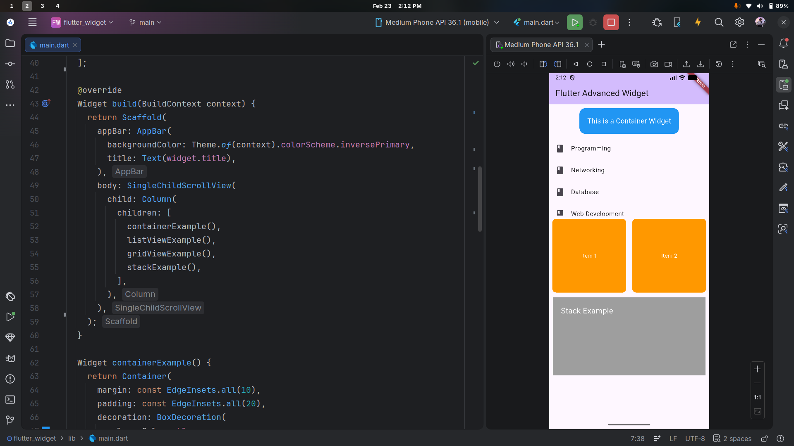

# Flutter Advanced Widget Demo

Simple Flutter app that demonstrates common layout and UI widgets in one scrollable screen.



## Overview

This project is a lab-style Flutter app showcasing how to compose multiple widget types in a single page using Material 3.

The home screen (`Flutter Advanced Widget`) includes:

- **Container example** with margin, padding, background color, and rounded corners
- **ListView.builder example** rendering a list of subjects
- **GridView.builder example** rendering a 2-column grid of items
- **Stack example** showing layered widgets with positioned text

## Tech Stack

- **Flutter** (Material 3)
- **Dart** SDK `^3.10.7`

## Project Structure

```text
lib/
	main.dart          # App entry point and widget examples
test/
	widget_test.dart   # Default Flutter widget test template
```

## Getting Started

### Prerequisites

- Flutter SDK installed
- A configured device/emulator (Android/iOS) or desktop target

Check your setup:

```bash
flutter doctor
```

### Install dependencies

```bash
flutter pub get
```

### Run the app

```bash
flutter run
```

## Useful Commands

```bash
# Analyze code
flutter analyze

# Run tests
flutter test
```
